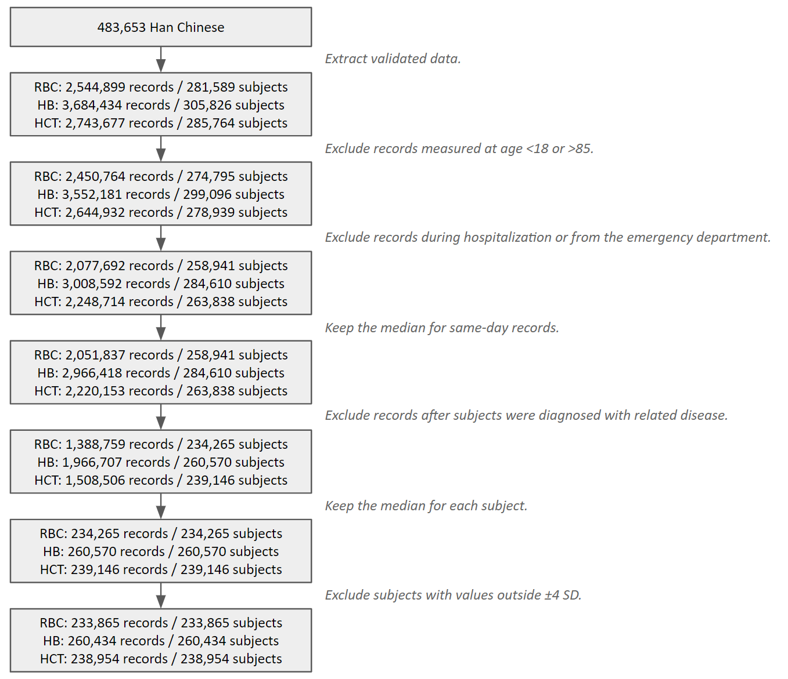
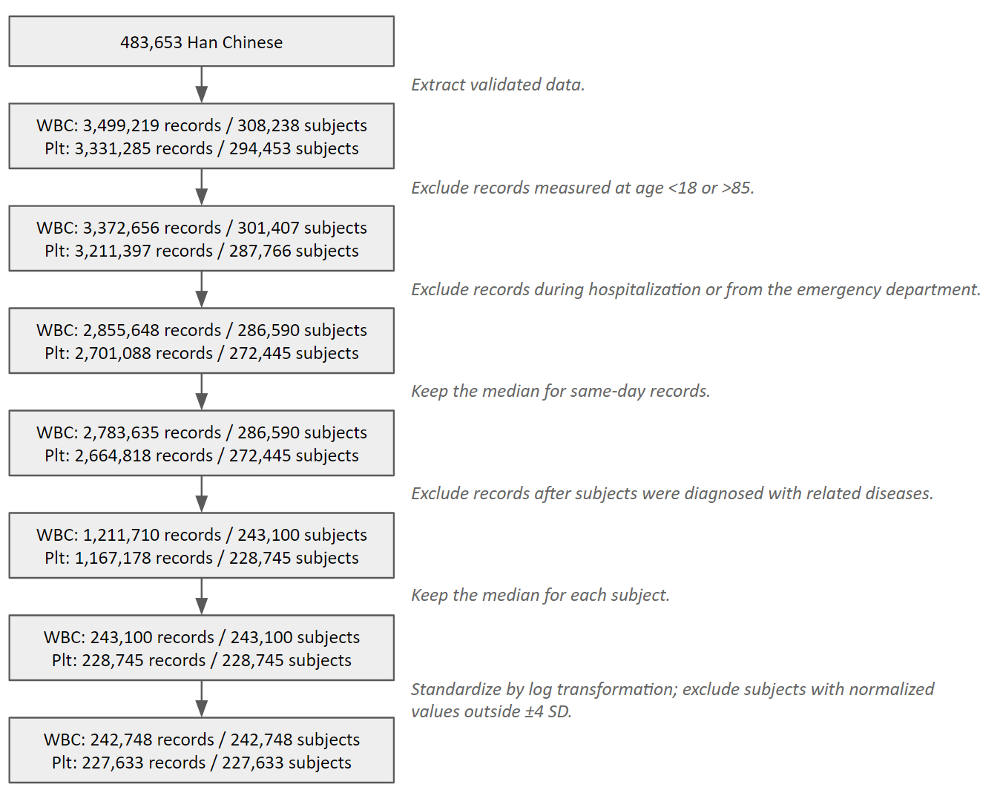
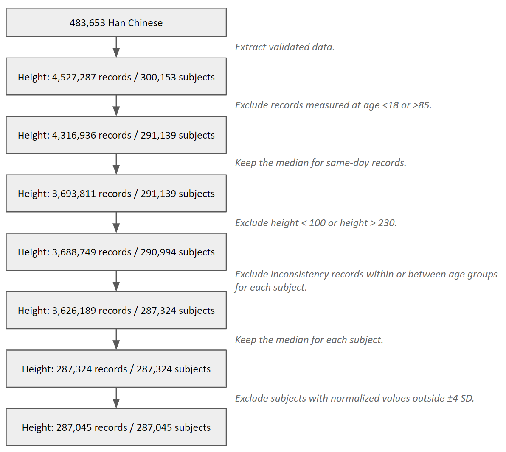
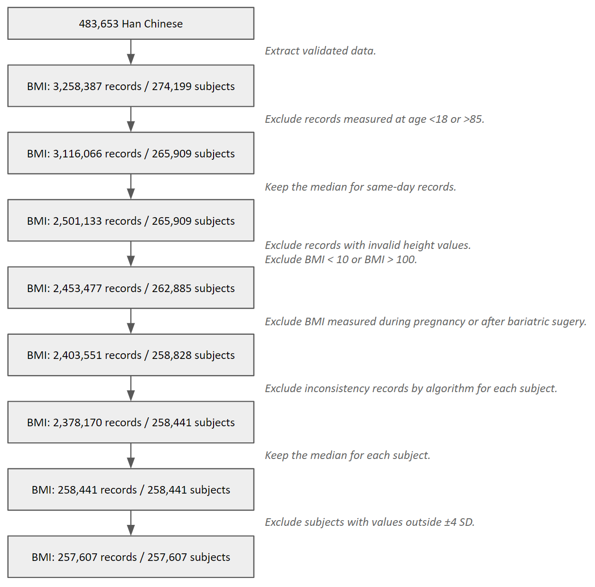
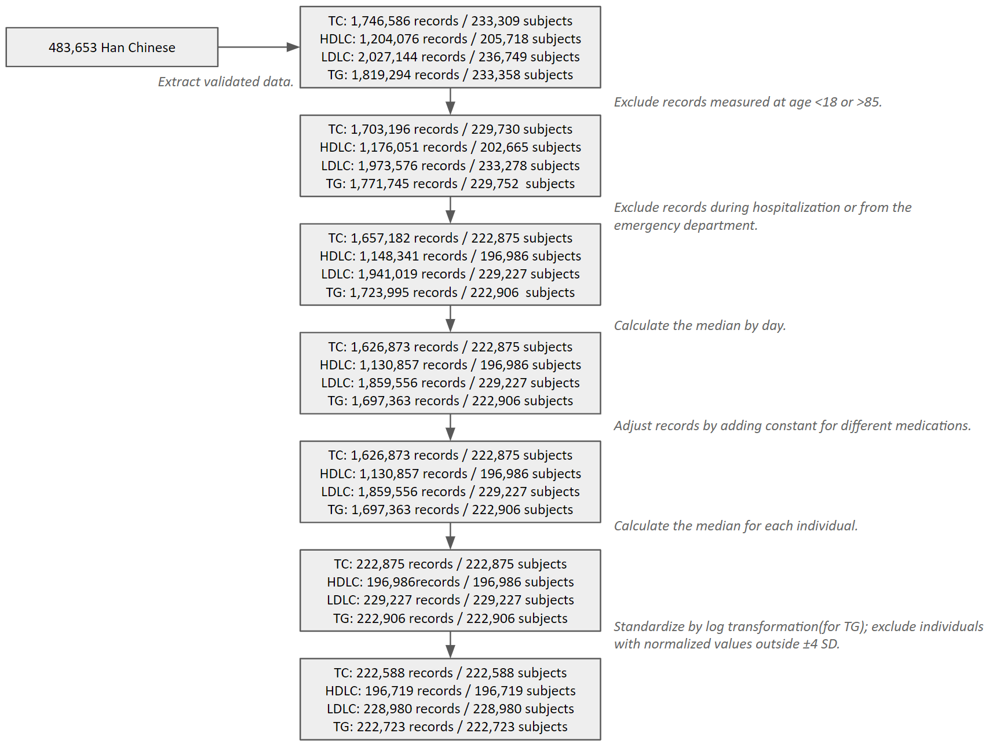
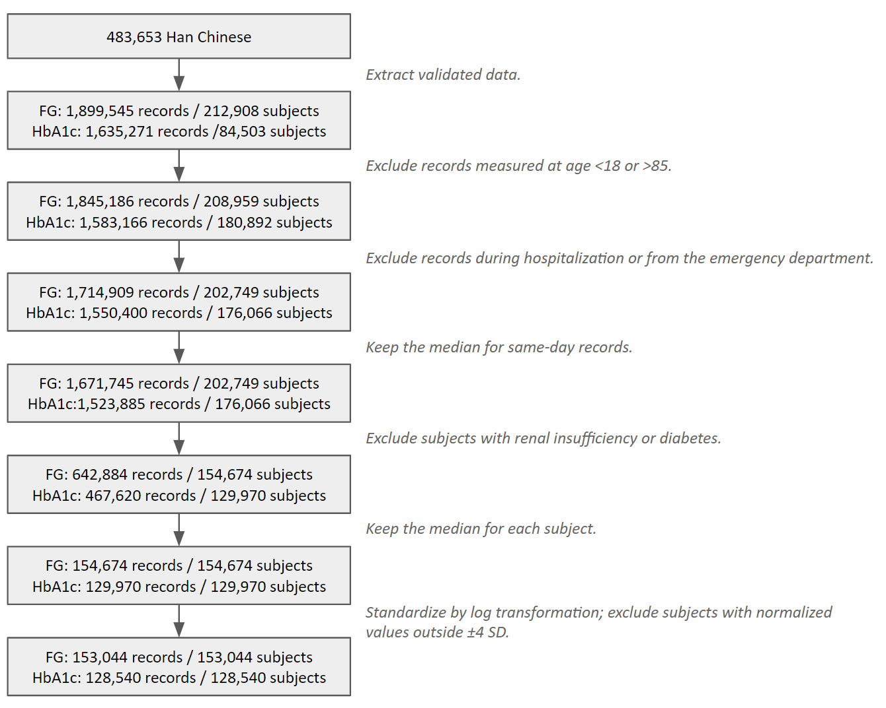
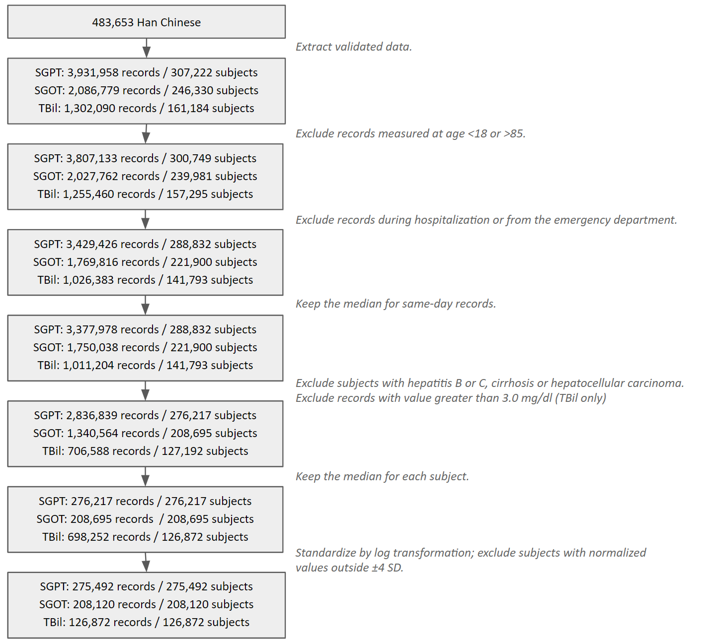
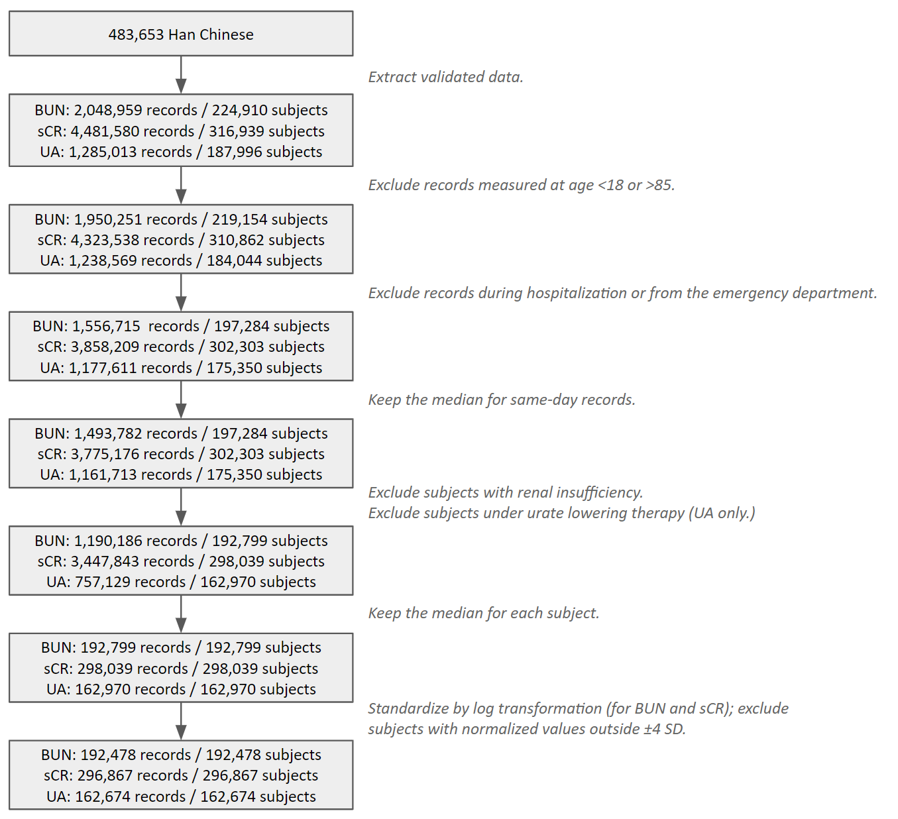
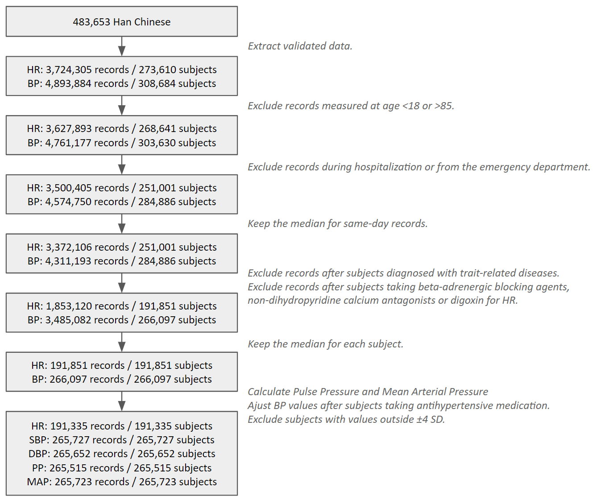

## Diseases and symptoms 
Phecode: https://phewascatalog.org/
## Anthropometric and laboratory measurements
Quality control for anthropometric and laboratory measurements. 
### Red blood cell

### White blood cell

### Body height

### Body mass index

### Blood lipids

### Blood glucose traits

### Liver-related measurements 

### Kidney-related measurements

### Vital signs

